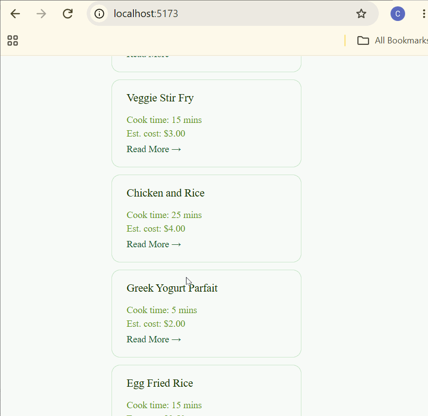
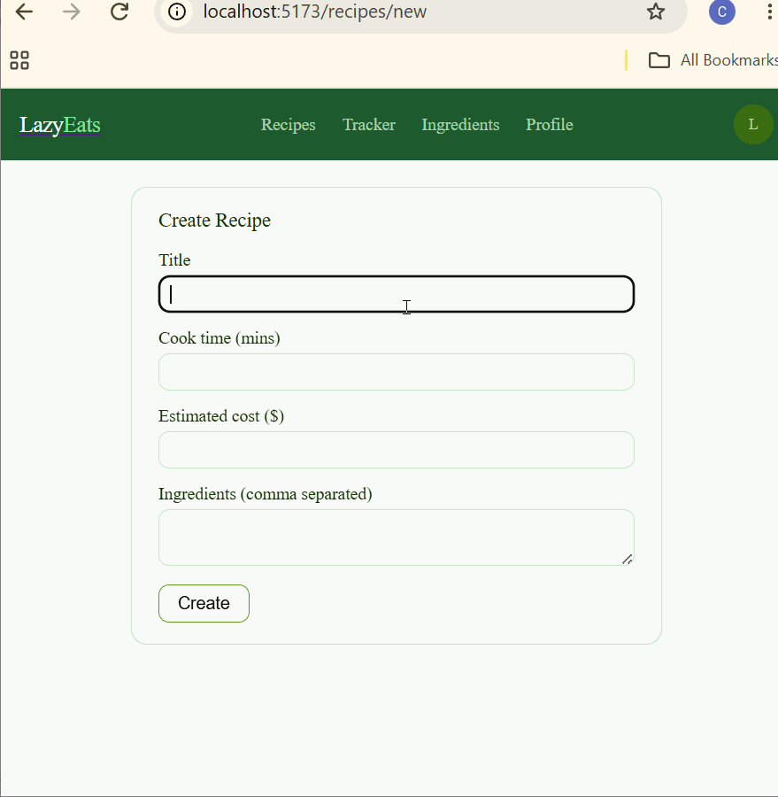
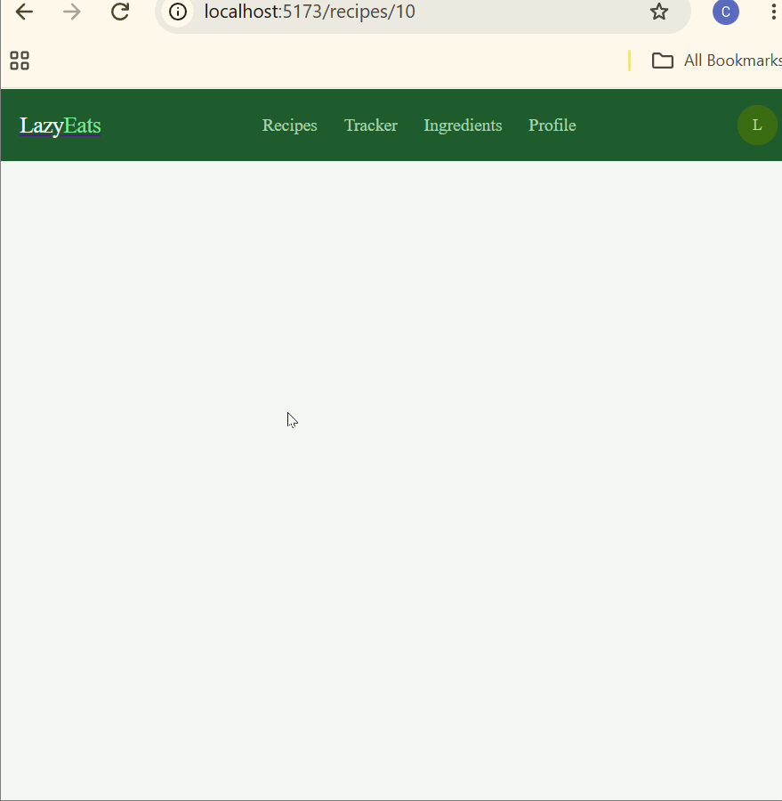
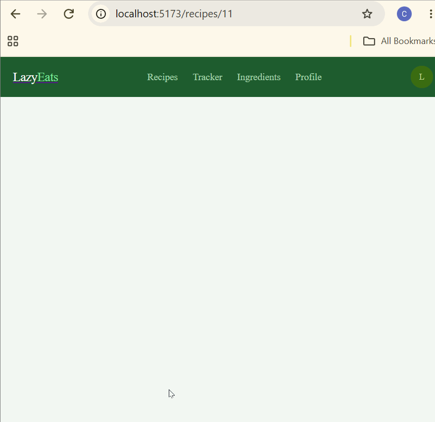

# LazyEat

CodePath WEB103 Final Project

Designed and developed by: Fabian, Liam, Raheem, Steph

🔗 Link to deployed app:

## About

### Description and Purpose

LazyEats is a full-stack web app that helps busy, budget-conscious people eat healthier without spending hours in the kitchen. Users can browse quick recipes (under 30 minutes), track their daily nutrition intake, and see how their meals compare to recommended daily values for key nutrients like protein, iron, and vitamin C. Every recipe includes an estimated cost and cooking time so users can plan meals around their weekly food budget.

### Inspiration

A lot of people (including ourselves) struggle to eat well, not because they don't care, but because healthy eating feels complicated and expensive. Poor nutrition affects how you feel and perform every day, yet most food apps are either too complex or ignore budget constraints entirely. LazyEats is built for people who want to eat better but need simple, affordable, and fast options to make that actually happen.

## Tech Stack

Frontend: React, React Router, CSS

Backend: Node.js, Express, PostgreSQL

## Features

### View All Recipes

Browse the full list of recipes as cards showing title, cook time, and estimated cost, with quick links into each recipe's detail page.

### View Single Recipe

Click into any recipe from the list to see its full detail page, including cook time, estimated cost, and the complete ingredient list.

### Create Recipe

Add a new recipe with a title, cook time, estimated cost, and a comma-separated list of ingredients through a simple form.

### Update Recipe

Edit an existing recipe's title, cook time, estimated cost, or ingredients, and save the changes from its detail page.

### Delete Recipe

Remove a recipe from the list entirely with one click from its detail page.

### Daily Nutrition Tracker

Log meals throughout the day and automatically calculate total nutrient intake. See a breakdown of protein, iron, vitamin C, and more compared to daily recommended values.
[gif goes here]

### Ingredient and Nutrient Database

Explore a library of ingredients and their nutritional content. Each ingredient is linked to multiple recipes and nutrients, helping users understand what they are eating.
[gif goes here]

### Recipe Detail Modal

Click any recipe card to open a modal showing full nutrition info, ingredients, steps, and estimated cost without navigating away from the current page.
[gif goes here]

### User Profile and Budget Settings

Users can set their weekly food budget and daily calorie goal. The app uses these preferences to personalize recipe suggestions and nutrition targets.
[gif goes here]

### Database Reset

Reset the entire database back to its default seeded state with one click, restoring all sample recipes, ingredients, and nutrients for demo purposes.
[gif goes here]

### [ADDITIONAL FEATURES GO HERE - ADD ALL FEATURES HERE IN THE FORMAT ABOVE; you will check these off and add gifs as you complete them]

## Installation Instructions

[instructions go here]
